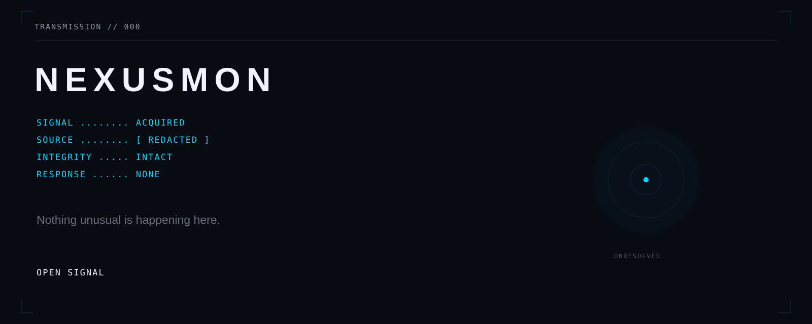

<div align="center">



# NEXUSMON

**Nothing unusual is happening here.**

```text
SIGNAL ........ ACQUIRED
SOURCE ........ [ REDACTED ]
INTEGRITY ..... INTACT
RESPONSE ...... NONE
```

</div>

A transmission was recovered.

No sender was found.

No request was made.

No explanation followed.

<p align="center">
  <a href="SIGNAL.md"><strong>OPEN SIGNAL</strong></a>
</p>
