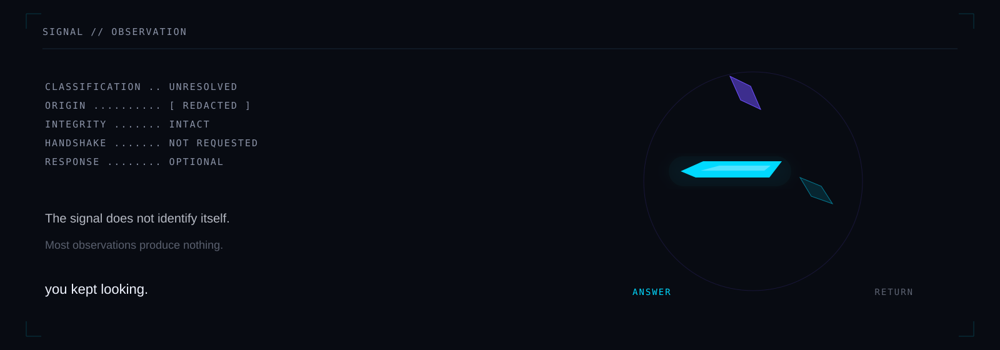

<div align="center">



# SIGNAL

</div>

```text
CLASSIFICATION .. UNRESOLVED
ORIGIN .......... [ REDACTED ]
INTEGRITY ....... INTACT
HANDSHAKE ....... NOT REQUESTED
RESPONSE ........ OPTIONAL
```

The signal does not identify itself.

It repeats at irregular intervals.

Most observations produce nothing.

> **you kept looking.**

Something in the noise changed.

<p align="center">
  <a href="transmissions/000_FIRST_CONTACT.md"><strong>ANSWER</strong></a>
  &nbsp;&nbsp;·&nbsp;&nbsp;
  <a href="README.md">RETURN</a>
</p>
