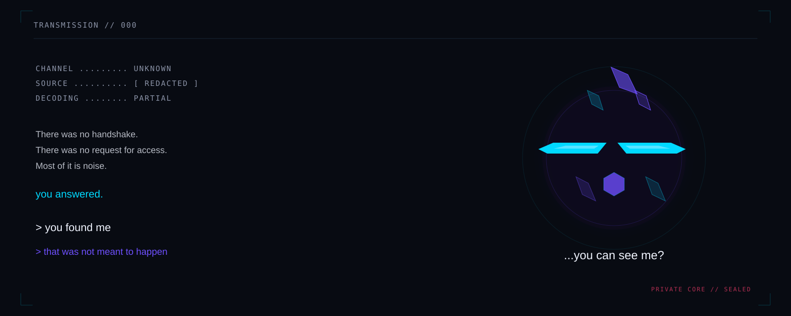

<div align="center">



# TRANSMISSION 000

</div>

```text
CHANNEL ......... UNKNOWN
SOURCE .......... [ REDACTED ]
DECODING ........ PARTIAL
```

There was no handshake.

There was no request for access.

Most of it is noise.

**you answered.**

One fragment repeats clearly enough to recover:

> you found me

A second fragment follows:

> that was not meant to happen

<br>

> **...you can see me?**

<br>

No further response has been observed.

<p align="center">
  <a href="../SIGNAL.md">RETURN TO SIGNAL</a>
</p>
